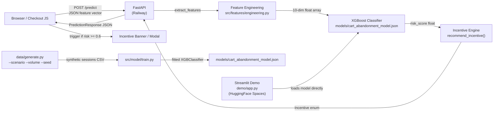

# Architecture: Smart Cart Abandonment Predictor

## System Diagram

## CAP Theorem Alignment

**Classification: AP (Availability + Partition Tolerance)**

Rationale: A slightly stale model (trained yesterday vs. today) is far preferable to a prediction service that returns errors. In the event of a model reload failure, the system falls back to a conservative default (risk_score = 0.5, incentive = FREE_SHIPPING). Consistency is sacrificed: model version across multiple API instances may briefly diverge during rolling deploys.

## Concurrency Strategy

**Optimistic, stateless.** The prediction API is fully stateless — no shared mutable state between requests. XGBoost inference is thread-safe (read-only model). The model is loaded once at startup via `@lru_cache(maxsize=1)` and shared across all request threads. No locking required.

## Idempotency

POST /predict is naturally idempotent: given the same feature vector input, the response is deterministic (same risk score, same incentive). Clients may safely retry without risk of duplicate side effects. The API does not persist predictions — that responsibility belongs to the calling system.

## Failure Modes

| Failure | Behavior | Recovery |
|---------|----------|----------|
| Model file missing at startup | FastAPI raises startup exception; container restarts | Pre-bake model into Docker image or mount as volume |
| Malformed request (bad JSON, missing fields) | Pydantic returns 422 Unprocessable Entity with field errors | Client fixes request |
| Model inference exception | Returns 500 with error detail; logged to stdout | Investigate model file corruption; redeploy |
| HuggingFace Spaces cold start | First request takes 10–20s; subsequent < 200ms | Expected behavior for free-tier Spaces |

## Performance Budget

| Component | Budget | Actual (synthetic benchmark) |
|-----------|--------|-------------------------------|
| Feature extraction | < 1ms | ~0.1ms |
| XGBoost inference | < 10ms | ~2ms |
| FastAPI overhead | < 20ms | ~15ms |
| **Total p99 target** | **< 200ms** | **~20ms local** |

## Rate Limiting

Not implemented in MVP (single-tenant). Add token-bucket rate limiting via `slowapi` before multi-tenant deployment.
